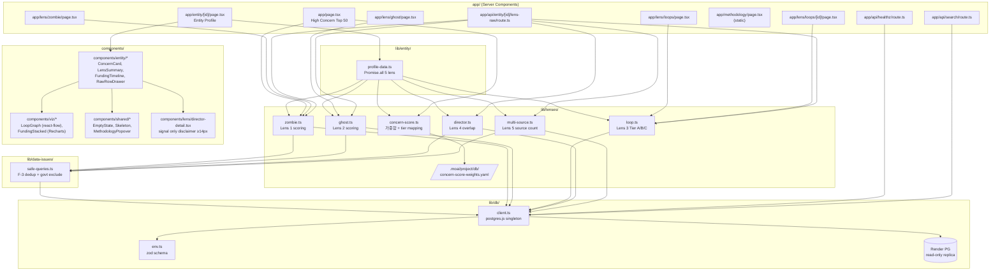
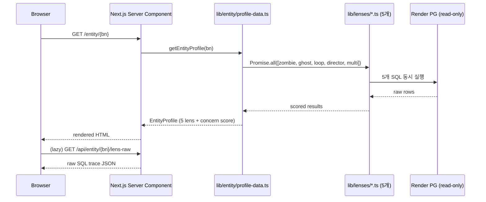

# Module Dependency Graph — apps/web

SPEC-RHI-001 구현 모듈 간 의존성. 화살표 방향은 import 방향.

## 전체 모듈 그래프

## 레이어별 의존 방향 원칙

| 레이어 | 의존 허용 | 의존 금지 |
|---|---|---|
| `app/` | `components/`, `lib/` | `lib/` 내부 구현 인라인 |
| `components/` | `lib/`, `components/ui/` | 다른 도메인 `components/` 직접 참조 |
| `lib/lenses/` | `lib/db/`, `lib/data-issues/` | `components/`, `app/` |
| `lib/data-issues/` | `lib/db/` | `lib/lenses/` (순환 방지) |
| `lib/db/` | Node stdlib | 없음 |

## 핵심 데이터 흐름

---

생성 기준: SPEC-RHI-001 v0.1.3 (2026-04-28)
