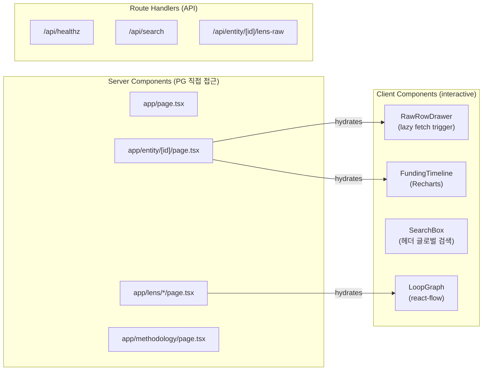
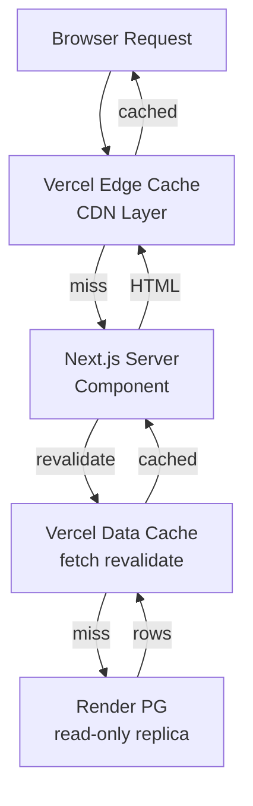

# Route Map — Next.js 라우트 + 캐싱 정책

SPEC-RHI-001 구현의 전체 라우트 목록, 렌더링 방식, 렌즈 호출 수, 캐싱 전략.

## 라우트 매트릭스

| 라우트 | 타입 | 주요 컴포넌트 | 렌즈 호출 | 캐싱 전략 | AC 매핑 |
|---|---|---|---|---|---|
| `/` | Server Component | 랜딩 + HighConcernRanking | 1 (zombie ranking) | `revalidate: 300` (5분) | AC-8a |
| `/entity/[id]` | Server Component | EntityProfile (5 lens 통합) | 5 (Promise.all) | `revalidate: 60` (1분) | AC-6, AC-12 |
| `/lens/zombie` | Server Component | ZombieRanking | 1 | `revalidate: 600` (10분) | AC-2, AC-9 |
| `/lens/ghost` | Server Component | GhostRanking | 1 | `revalidate: 600` (10분) | AC-9 |
| `/lens/loops` | Server Component | LoopRanking + TierDistribution | 1 | `revalidate: 600` (10분) | AC-3, AC-4 |
| `/lens/loops/[id]` | Server Component | LoopDetail + react-flow graph | 1 | `revalidate: 600` (10분) | AC-3, AC-4 |
| `/methodology` | Server Component | 정적 마크다운 렌더 | 0 | `revalidate: 3600` (1시간) | AC-10 |
| `/api/healthz` | Route Handler | DB ping (SELECT 1) | 0 | dynamic (no-store) | AC-1 |
| `/api/search` | Route Handler | vw_entity_search | 0 | dynamic (no-store) | AC-7 |
| `/api/entity/[id]/lens-raw` | Route Handler | per-lens raw row fetch | 1 (per request) | dynamic (no-store) | AC-6 |

## Server vs Client Component 구분

## 미들웨어 (Edge)

| 미들웨어 | 위치 | 역할 | 설정 |
|---|---|---|---|
| Rate Limiter | `middleware.ts` (Vercel Edge) | IP-based 30 req/min | 초과 시 HTTP 429 |

미들웨어는 `/api/*` 포함 모든 라우트에 적용. `/api/healthz`는 rate limit에서 제외 (모니터링 용도).

## 캐싱 계층

| 계층 | 범위 | TTL |
|---|---|---|
| Vercel CDN | 전역 엣지 | Server Component `revalidate` 값 |
| Vercel Data Cache | per-fetch | `revalidate` 값 |
| postgres.js pool | 서버 프로세스 내 | 연결 재사용 (idle_timeout: 20s) |

## 성능 목표 (warm cache 기준)

| 라우트 | 목표 TTFB | 실측 근거 |
|---|---|---|
| `/api/healthz` | < 200ms | AC-1 |
| `/` | < 800ms | AC-8a |
| `/entity/[id]` | < 1200ms | AC-12 |
| `/lens/*` | < 1000ms | AC-2, AC-3 |
| `/methodology` | < 200ms | 정적 (0 DB 호출) |

---

생성 기준: SPEC-RHI-001 v0.1.3 (2026-04-28)
